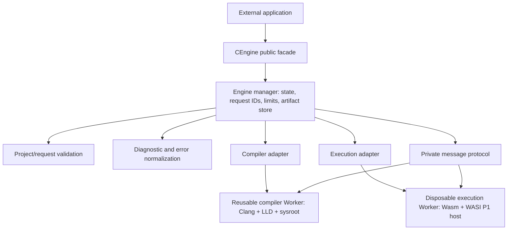
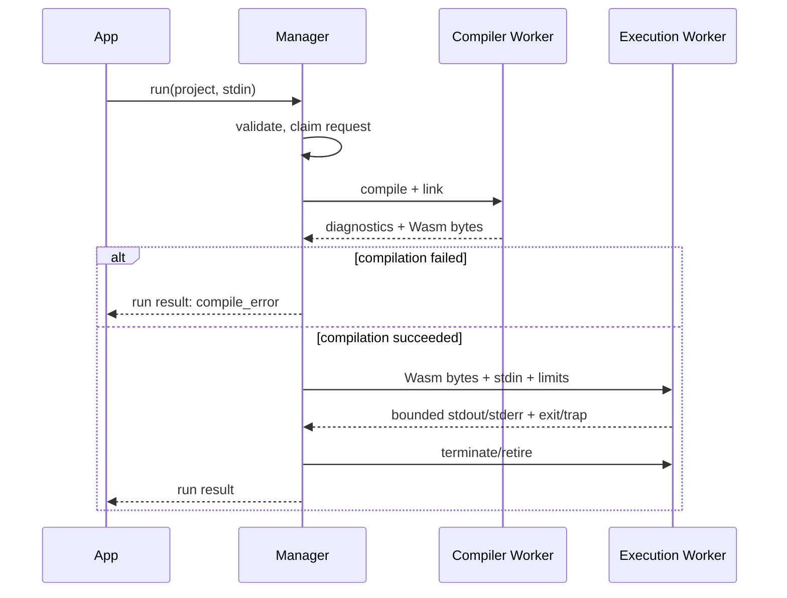

# Engine architecture

## Overview

The package is an IDE-independent ES module. Its public facade owns validation, state, request admission, and normalized results. A compiler adapter owns the pinned browser Clang/LLD invocation. A WASI execution adapter owns program instantiation. Compiler and program code run in **different dedicated Workers** so a program loop cannot block or corrupt the compiler context. No backend participates in normal use. [Toolchain choice](PHASE-0-COMPILER-RESEARCH.md).

## Responsibilities and ownership

| Component | Owns | Does not own |
| --- | --- | --- |
| `CEngine` facade/manager | Lifecycle state, one active operation, monotonic request ID and generation, public errors/results, timers, artifact token to bytes mapping | Compiler internals or IDE state |
| Validator and project mapper | Schema and byte limits; canonical relative POSIX paths; C source list and permitted options | Files outside the request or actual host filesystem |
| Compiler adapter | Stable translation from admitted project to pinned Clang/LLD commands; sysroot placement; compile/link responses | Public API objects or user execution |
| Diagnostic normalizer | Clang/LLD text to bounded portable diagnostic records plus bounded raw text | Compiler success policy |
| Execution adapter | Per-run Worker, restricted WASI imports, stdin/fd setup, byte-capped output and exit/trap capture | Compilation or persistent user files |
| Private protocol | Versioned message envelope and shape checks on both sides | Business semantics |

Validation and project mapping can initially be one module. State, timers, cancellation and recovery belong together in the manager: splitting each into a module would create circular ownership. The two adapters are separate because they invoke different Wasm modules and have different lifetimes. The execution Worker is fresh per `execute()`/successful `run()`; the compiler Worker is reusable until reset, cancellation during compilation, failure, or disposal. Neither Worker may write into main application state. Artifact bytes remain in the manager's private in-memory map and are never returned as a `WebAssembly.Module` or raw compiler object.

## Dependency direction and communication

The public facade depends on manager and portable schemas. The manager depends on validation, normalizers, limits and adapter interfaces. Adapters depend on private protocol and pinned third-party code. Workers cannot import the public API. A message is `{protocolVersion, generation, requestId, kind, payload}`. Unknown kinds, oversized fields, unexpected versions and malformed responses cause a bounded engine error and worker retirement. All source paths and command arguments are generated after validation; arbitrary user flags never enter Clang.

The manager accepts **one compile or execute operation at a time**. Concurrent calls reject `BUSY`; it does not silently queue work. `run()` is one operation spanning compile then execute. `initialize()` is deduplicated and asynchronous. Compile failure is a returned compilation result; infrastructure failure rejects with `CEngineError`. Details are in [API](PUBLIC-API.md) and [lifecycle](LIFECYCLE.md).

## Flows

Initialization resolves immutable asset URLs against the package/explicit asset base, loads and verifies the pinned toolchain manifest, starts the compiler Worker and awaits its ready response. The manager then transitions to `ready`. Execution assets are loaded per execution Worker, subject to browser caching. There is no compiler execution on the page's main thread.

On cancellation or timeout, the manager marks the request settled, terminates its active Worker, increments generation, drops all artifact handles, and recreates the compiler Worker if it was terminated. Late messages fail the generation/request check. Recovery ends in `ready` or `failed`; `dispose()` ends in `disposed`. See [lifecycle](LIFECYCLE.md).

## Trade-offs

- Two Worker roles and per-run execution Worker creation cost more startup time and memory than one reused Worker. They give reliable termination of runaway C without discarding a healthy compiler and avoid cross-run filesystem state.
- An opaque artifact map supports compile-once/execute-many inside one engine generation without exposing toolchain objects. Reset invalidates handles even though raw bytes might technically survive; this makes version and ownership rules simple.
- A same-origin Worker is a baseline execution boundary. A separately hosted sandbox origin is needed for stronger protection of the parent application from a compromised compiler/runtime. See [security](SECURITY-MODEL.md).
- The browsercc convenience wrapper does not prove multi-file linking. The adapter boundary preserves the public contract while Phase 1 tests its lower-level Clang/LLD path.

## Proposed source layout

See [project structure](PROJECT-STRUCTURE.md). Only directories with concrete code belong in the repository during implementation; Phase 0 creates documentation only.
