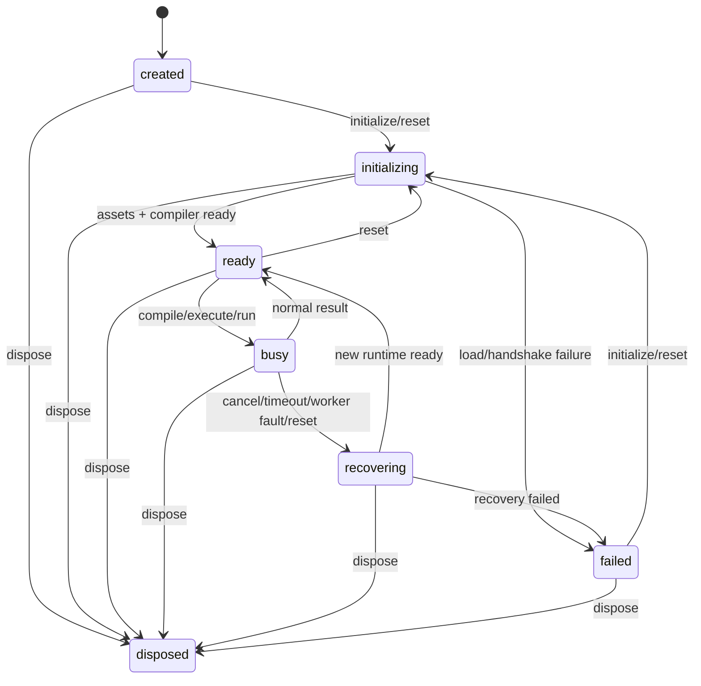

# Lifecycle and concurrency contract

## States

`created`, `initializing`, `ready`, `busy`, `recovering`, `failed`, `disposed` are externally visible. `disposed` is terminal. There is exactly one admitted compile/execute/run operation. `isBusy()` is true in `busy` and in `recovering` if recovery belongs to an active operation; `isReady()` is true only in `ready`.



| Current | Operation | Transition/result |
| --- | --- | --- |
| `created` | `initialize()` or `reset()` | `initializing`; promise resolves at `ready` or rejects at `failed` |
| `initializing` | another `initialize()` | Return same promise; no duplicate Worker |
| `initializing` | compile/run/execute | Reject `NOT_READY` |
| `ready` | `initialize()` | Already resolved; no reload |
| `ready` | compile/run/execute | `busy`; one request admitted |
| `busy` | compile/run/execute or initialize | Reject `BUSY`; no hidden queue |
| `busy` | `cancel()` | `recovering`; reject operation `CANCELLED`, terminate active Worker, increment generation, invalidate artifacts |
| `busy` | `reset()` | `recovering`; reject operation `RESET`, retire both Worker roles, invalidate artifacts |
| `ready` or `failed` | `reset()` | `initializing`; clean runtime and artifact store |
| `failed` | `initialize()` | Retry fresh initialization |
| any non-disposed | `dispose()` | `disposed`; reject active work `DISPOSED`; idempotent |
| `disposed` | anything except state readers/`dispose()` | Reject `DISPOSED` |

`cancel()` with no active work resolves `false`. `cancel()` during `initializing` resolves `false`; use `dispose()` or `reset()` to stop initialization. During a recovery caused by cancellation, concurrent `cancel()` calls share the first promise. `reset()` during `initializing` supersedes the old initialization, invalidates its generation, and starts a fresh one; the old promise rejects `RESET`. `reset()` during `recovering` supersedes recovery. State readers remain synchronous, with `getRuntimeInfo()` returning `null` outside `ready`/`busy`.

## Identity and stale responses

Each manager instance has a private engine identity. `generation` increments before every initialization attempt and before any worker retirement/recovery that invalidates artifacts. `requestId` is monotonically increasing within the instance. Worker messages echo `{protocolVersion, generation, requestId}`; the manager checks all three plus expected message kind and state before accepting data. Late messages from a terminated Worker are ignored and counted privately, never applied to a newer request. Artifact handles carry origin and generation checks; an artifact from another engine or generation rejects `INVALID_ARTIFACT`.

## Initialization, execution, cancellation, recovery

```mermaid
sequenceDiagram
  participant Caller
  participant Manager
  participant Compiler as Compiler Worker
  Caller->>Manager: initialize()
  Manager->>Manager: generation++, initializing
  Manager->>Compiler: start pinned assets, handshake
  Compiler-->>Manager: protocol + build info + ready
  Manager-->>Caller: resolve; ready
```

```mermaid
sequenceDiagram
  participant Caller
  participant Manager
  participant Compiler as Compiler Worker
  participant Runner as Execution Worker
  Caller->>Manager: run(request)
  Manager->>Manager: requestId++, busy
  Manager->>Compiler: compile/link
  Compiler-->>Manager: Wasm bytes/diagnostics
  Manager->>Runner: instantiate + _start
  Runner-->>Manager: exit/trap + bounded output
  Manager->>Runner: terminate
  Manager-->>Caller: result; ready
```

```mermaid
sequenceDiagram
  participant Caller
  participant Manager
  participant Active as Active Worker
  Caller->>Manager: cancel() or deadline fires
  Manager->>Manager: mark request settled; generation++
  Manager->>Active: terminate immediately
  Manager-->>Caller: active operation rejects
  opt compiler Worker was terminated
    Manager->>Manager: recreate compiler runtime
  end
  Manager-->>Caller: cancel resolves after ready (or rejects on failed recovery)
```

The manager owns deadline timers. An execution Worker gets no cooperative-cancel assumption; a C infinite loop blocks its own event loop, so an in-Worker cancel message is insufficient. `Worker.terminate()` is the stopping mechanism documented by the browser platform. [MDN](https://developer.mozilla.org/en-US/docs/Web/API/Worker/terminate). If compiler termination occurs, rebuild the compiler Worker; execution Worker failure requires retirement and generation invalidation but can reuse a healthy compiler. All recovery paths clear artifacts for simple version safety. A failed recovery moves to `failed` and requires explicit retry.

## Runtime sharing decision

Compilation and user execution **do not share a Worker**. The browsercc compiler can be invoked through its own Worker; generated C runs through a separate WASI host. This choice is architectural and will be validated in Phase 1, including whether compiler reinitialization after termination is reliable.
