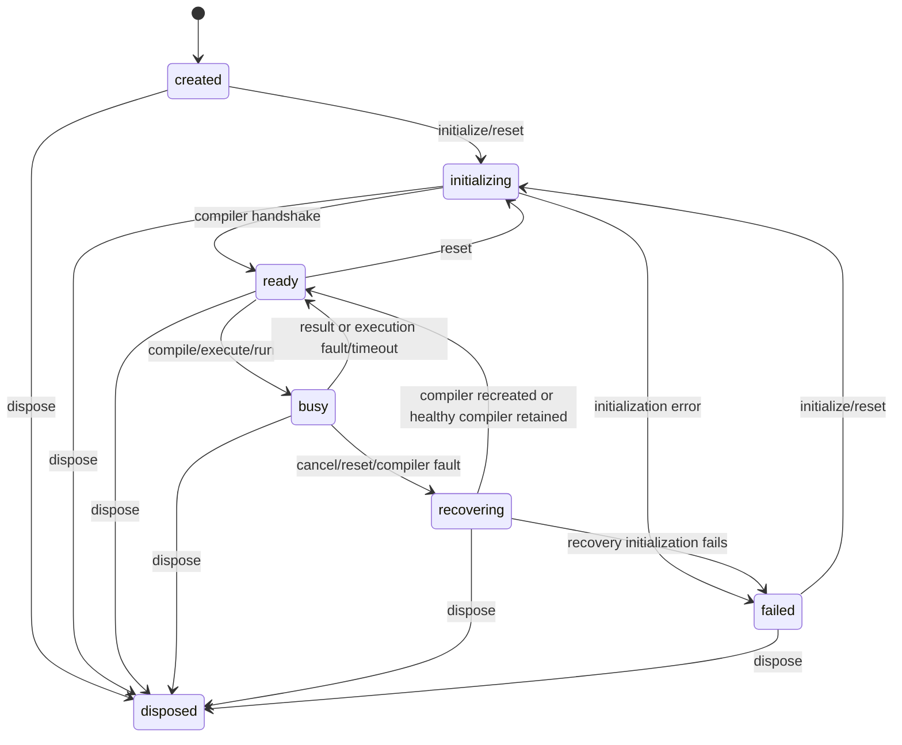

# Phase 2 lifecycle and public API contract

_Implemented and browser-tested on 2026-10-03. This document supersedes the proposed behavior in [Phase 0 lifecycle](LIFECYCLE.md) for the current code; it does not rewrite the Phase 0 or Phase 1 historical records._

_Phase 3 addendum:_ The default compiler asset directory is now `runtime/browsercc-0.1.1/` in the prepared package, and asset failures follow the [Phase 3 integrity contract](PHASE-3-INTEGRITY.md). Lifecycle method signatures and admission rules below are unchanged.

## States and admission

The public state names remain `created`, `initializing`, `ready`, `busy`, `recovering`, `failed`, and terminal `disposed`. A separate `compiling` or `running` public state was considered but adds no useful admission rule: `busy` covers either operation, while a private active request identifies the Worker role. `resetting` is expressed as `initializing` or `recovering`. `getState()` is synchronous. `isReady()` is true only in `ready`; `isBusy()` is true throughout `busy` and `recovering`. `getRuntimeInfo()` is a frozen snapshot in `ready`/`busy`, otherwise `null`.

| State | `initialize()` | `compile()` / `execute()` / `run()` | `cancel()` | `reset()` | `dispose()` |
| --- | --- | --- | --- | --- | --- |
| `created` | Start compiler | Reject `NOT_READY` | Resolve `false` | Start compiler | Terminal cleanup |
| `initializing` | Return same initialization promise | Reject `NOT_READY` | Resolve `false` | Supersede old initialization; old rejects `RESET` | Old initialization rejects `DISPOSED` |
| `ready` | Resolve, no new Worker | Admit one operation | Resolve `false` | Recreate compiler and invalidate artifacts | Terminal cleanup |
| `busy` | Reject `BUSY` | Reject `BUSY` | Interrupt and recover | Interrupt and recreate compiler | Interrupt and terminate |
| `recovering` | Reject `BUSY` unless reset recovery is itself exposed as `initializing` | Reject `BUSY` | Return same in-flight cancellation promise if one exists; otherwise `false` | Supersede recovery | Terminal cleanup |
| `failed` | Retry with new compiler Worker | Reject `NOT_READY` | Resolve `false` | Retry with new compiler Worker | Terminal cleanup |
| `disposed` | Reject `DISPOSED` | Reject `DISPOSED` | Reject `DISPOSED` | Reject `DISPOSED` | Return same resolved disposal promise |

One compile, execute, or run operation is admitted at a time. There is no queue and no overlap between compilation and execution. `run()` occupies the slot across both stages. Validation occurs before Worker dispatch, after slot admission, so overlapping requests consistently reject `BUSY`. A valid operation result releases the slot. C syntax/link errors and nonzero exits are resolved results, not engine failures.

## Method behavior

| Member | Contract |
| --- | --- |
| `new CEngine({ assetBaseUrl?, limits? })` | Synchronous validation. `assetBaseUrl` is an HTTP(S) directory URL ending `/`; default is the repository-local browsercc asset directory. Only documented limit keys are accepted; invalid static options throw `TypeError`. No Worker starts in the constructor. |
| `initialize(): Promise<void>` | Starts one compiler Worker, waits for the pinned toolchain handshake, and shares the exact same promise among concurrent callers. A repeated ready call resolves without another Worker. A failure enters `failed`; a later call retries. |
| `compile(request): Promise<CompilationResult>` | Validates, compiles and links without running. Success returns an opaque artifact; a C compile/link failure returns `status: "error"` with diagnostics. |
| `execute(artifact, {stdin?} = {}): Promise<ExecutionResult>` | Accepts only a handle made by this engine in its current generation. Uses a fresh execution Worker. Artifact can be executed repeatedly until invalidated. |
| `run(request): Promise<RunResult>` | Validates source project and stdin, then compiles and executes on success. Compile error returns `status: "compile_error"`, `execution: null`; no artifact is returned. |
| `cancel(): Promise<boolean>` | During an active operation, reject it `CANCELLED`, terminate its Worker if dispatched, invalidate all artifacts, and resolve `true` after recovery. Repeated calls during that cancellation return the same promise. Idle or initializing calls resolve `false`. |
| `reset(): Promise<void>` | Retire both Worker roles, reject active operation or superseded initialization `RESET`, clear artifacts/runtime info, and initialize a fresh compiler Worker. Concurrent resets return the same promise. Works from `created`, `ready`, `busy`, `initializing`, `recovering`, or `failed`. |
| `dispose(): Promise<void>` | Terminal and idempotent. Reject active or initializing work `DISPOSED`, remove listeners/timers, terminate owned Workers, clear artifacts and runtime info. Repeated calls return the same promise. |

Cancellation during a compiler request terminates the compiler Worker and reloads the toolchain in a new Worker before `cancel()` resolves. Cancellation during execution terminates only the execution Worker and retains the healthy compiler Worker. An immediate cancellation before Worker dispatch prevents dispatch. Reset always recreates the compiler Worker and refetches its sysroot, although the browser cache may satisfy the fetch; it does not promise to preserve decoded compiler assets. A timeout of an execution Worker rejects `TIMEOUT`, invalidates artifacts, and leaves the compiler usable. A compiler Worker timeout/fault triggers automatic reinitialization before the original operation rejects; if that recovery fails, state is `failed` and an explicit `initialize()` or `reset()` may retry. A reset or disposal can supersede any recovery.

The engine owns Worker instances, one active protocol call and its deadline timer, one operation interruption promise, initialization/reset/cancel promises, runtime info and artifact bytes. `requestId` increases monotonically; `generation` changes on initialization and every retirement that invalidates artifacts. A stale response with another request ID is ignored. A malformed response for the active request rejects `PROTOCOL_ERROR` and retires that Worker. Late responses from retired Workers cannot settle a new request because listeners are removed and identity checks remain. An artifact handle from another engine or generation rejects `INVALID_ARTIFACT`.

The current API remains repository-local. No IDE state, UI framework, backend executor, event emitter, optional inspection, or production asset manifest was added. [Validation and protocol](PHASE-2-VALIDATION-AND-PROTOCOL.md) lists error codes and exact input rules.
